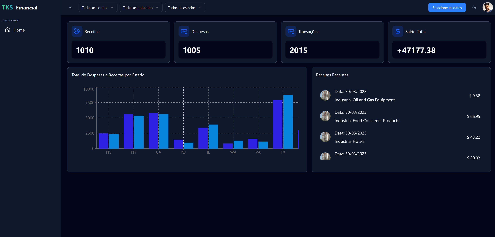

## TKS Financial
Sitio de Panel Financiero

<h1 align="center">
  
</h1>

<br /><br />

## 🚀 Tecnologías
- [TypeScript](https://www.typescriptlang.org/) > Lenguaje principal de la aplicación
- [NextJS](https://nextjs.org/) > Framework de React para creación de diseño
- [TailwindCSS](https://tailwindcss.com/) > Extensión para estilizar páginas en NextJS
- [Shadcn](https://ui-v4.shadcn.com/) > Biblioteca de componentes para NextJS
- [Lucide React](https://lucide.dev/) > Biblioteca de íconos
- [Next Intl](https://next-intl.dev/) > Biblioteca para traducción de textos
- [Recharts](https://recharts.org/en-US) > Biblioteca para gráficos
<br /><br />

## 💻 Ejecutando el Proyecto

#### Paso 1 - Configura las herramientas necesarias:
- [Node.js](https://nodejs.org/en/) (Versión 22)

#### Paso 2 - Instala las dependencias:
```bash
$ npm install
```

#### Paso 3 - Configura el archivo .env (Introduce cualquier correo y contraseña):

```bash
NEXT_PUBLIC_LOGIN_USER=""
NEXT_PUBLIC_LOGIN_PASSWORD=""
```

#### Paso 4 - Ejecuta el proyecto:
```bash
# development
$ npm run dev
```

<br /><br />

## Enlace del Deploy y Credenciales
https://tks-financial.vercel.app<br /><br />
Login: thiago@gmail.com<br />
Contraseña: 123456