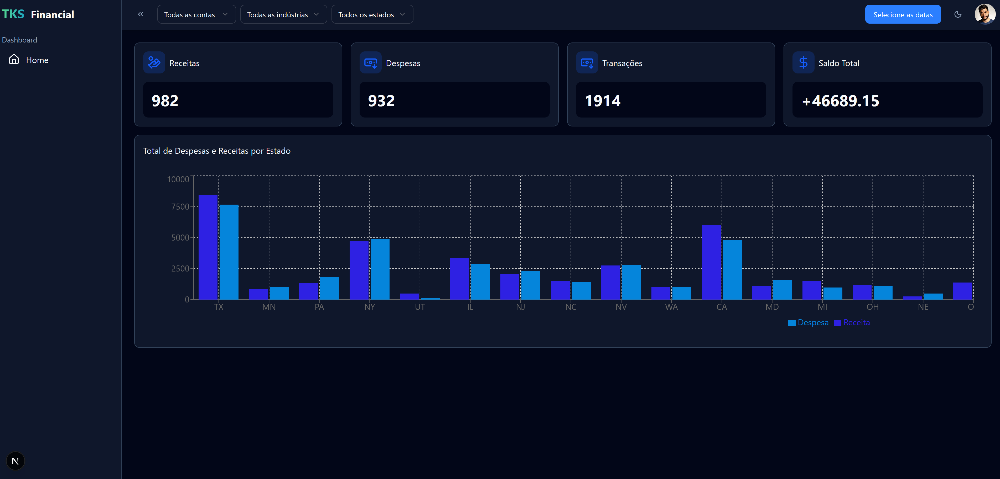

## TKS Financial
Financial Dashboard Website

<h1 align="center">
  
</h1>

<br /><br />

## 🚀 Technologies
- [TypeScript](https://www.typescriptlang.org/) > Main language of the application
- [NextJS](https://nextjs.org/) > React framework for layout creation
- [TailwindCSS](https://tailwindcss.com/) > Extension for NextJS for page styling
- [Shadcn](https://ui-v4.shadcn.com/) > Component library for NextJS
- [Lucide React](https://lucide.dev/) > Icon library
- [Next Intl](https://next-intl.dev/) > Library for text translation
- [Recharts](https://recharts.org/en-US) > Library for Charts
<br /><br />

## 💻 Running the Project

#### Step 1 - Set up the necessary tools to run the project:
- [Node.js](https://nodejs.org/en/) (Version 22)


#### Step 2 - Install the dependencies:
```bash
$ npm install
```

#### Step 3 - Configure the .env file (Enter any email and password):

```bash
NEXT_PUBLIC_LOGIN_USER=""
NEXT_PUBLIC_LOGIN_PASSWORD=""
```

#### Step 4 - Run the project:
```bash
# development
$ npm run dev
```

<br /><br />

## Deploy Link and Credentials
https://tks-financial.vercel.app<br /><br />
Login: thiago@gmail.com<br />
Password: 123456